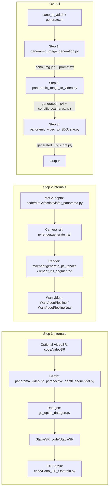
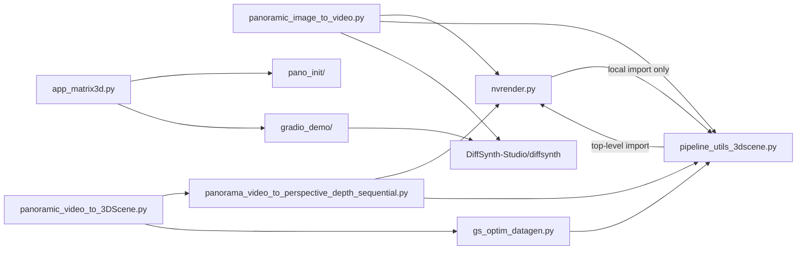

# ARCHITECTURE.md — Matrix-3D

> Machine-readable map of this repository. Read this before crawling files.
> Paths are relative to the repo root (`d:\Dev\Matrix-3D`).

## 1. Executive Summary

**Matrix-3D** generates omnidirectional, explorable 3D worlds from a text prompt or a single image. The core business logic is a **three-stage pipeline**:

1. **Panorama generation** — text/image → equirectangular 360° panorama (FLUX.1 + LoRA).
2. **Panoramic video generation** — panorama → depth (MoGe) → camera rail render → Wan video diffusion (14B or 5B).
3. **3D scene reconstruction** — video → per-frame perspective depth → multi-view datagen → StableSR super-resolution → 3D Gaussian Splatting training → `generated_3dgs_opt.ply`.

**Core stack:** Python 3 + PyTorch (CUDA), nvdiffrast (GPU mesh rasterization), OpenCV (video I/O, no ffmpeg), Gradio (web UI), bash orchestrators. All heavy models are vendored under `code/` and loaded from `checkpoints/`.

**Primary entry points:**

| Entry point | Purpose |
|---|---|
| `pano_to_3d.sh` | **Main CLI**: user panorama image → video → 3D scene (Steps 2+3). |
| `generate.sh` | Full pipeline incl. Step 1 (text/image → panorama). |
| `wsl_generate.sh` | WSL wrapper: activates conda env `matrix3d`, then runs `generate.sh`. |
| `code/app_matrix3d.py` | Gradio web demo (t2p/i2p → video → 3D scene). |

**Runtime environment:** the pipeline runs in a **WSL conda env `matrix3d`** (`/home/ron/miniconda3`), NOT the Windows base env. Target hardware: RTX 3090 (24 GB VRAM) / 96 GB RAM. Syntax-check command:

```
wsl bash -lc "source /home/ron/miniconda3/etc/profile.d/conda.sh && conda activate matrix3d && python -m py_compile <files>"
```

## 2. Component Directory Map

### Top level

| Path | Purpose |
|---|---|
| `pano_to_3d.sh` | Main CLI orchestrator (Steps 2+3). Parses `--low-vram`/`--vram-mgmt`/`--output-dir`, passes all other `--opts` to Step 2. |
| `generate.sh` | Full pipeline (Steps 1+2+3) with hardcoded prompt. |
| `wsl_generate.sh` | WSL conda-env wrapper around `generate.sh`. |
| `INSTALL.md` | Setup instructions. |
| `data/` | Sample inputs (panoramas, prompts, test cameras). |
| `output/` | Pipeline outputs (one dir per run). |
| `asset/` | Logo + demo images (`i2p/`, `t2p/`, `movement/`). |
| `checkpoints/` | All model weights (see §6). |
| `models/` | Secondary model dir (Wan-AI). |
| `submodules/` | CUDA C++ extensions: `nvdiffrast`, `simple-knn`, `diff-gaussian-rasterization-w-pose`, `ODGS`. |

### `code/` — pipeline scripts (first-party)

| Path | Purpose |
|---|---|
| `app_matrix3d.py` | Gradio app. Drives `pano_init` (t2p/i2p), `gradio_demo.image_to_video`, `gradio_demo.extract_3d_scene`. |
| `panoramic_image_generation.py` | **Step 1**: text→panorama (FLUX.1-dev + `text2panoimage_lora`) or image→panorama (`pano_init.i2p_model.i2pano`). Uses `enable_sequential_cpu_offload()` to fit 24 GB. |
| `panoramic_image_to_video.py` | **Step 2**: panorama → MoGe depth → camera rail → render → Wan video. See §4. |
| `panoramic_video_to_3DScene.py` | **Step 3**: video → depth → datagen → StableSR → 3DGS train. See §4. |
| `panoramic_video_480p_to_3DScene_lrm.py` | Alternative Step 3 using **Pano_LRM** (`SATVideoDiffusionEngine`) instead of the depth+StableSR+3DGS chain. |
| `download_checkpoints.py` | Downloads all weights from HuggingFace (`Skywork/Matrix-3D`, `Ruicheng/moge-vitl`, `Iceclear/StableSR`) into `checkpoints/`. |
| `generate_example_camera.py` | Emits `test_cam_{front,back,left,right}.json` — 81-frame straight rails in the preset-rail JSON format (list of 4×4 c2w matrices). |
| `lissajous_utils.py` | 2D Lissajous arc-length helper (scipy `quad`). |
| `lissajous_constant_speed_parameterization.py` | 2D arc-length reparameterizer (NOT used by the rail; rail uses equispaced t). |
| `gradio_demo/image_to_video.py` | `Video_Gen_Single` / `Video_Gen_Multi` — Wan video generation for the Gradio app. |
| `gradio_demo/extract_3d_scene.py` | `Extract_Scene` — Step 3 wrapper for the Gradio app. |

### `code/utils_3dscene/` — shared 3D utilities (first-party, importable)

| File | Purpose |
|---|---|
| `nvrender.py` | **GPU rendering core** (nvdiffrast). Mesh-from-panorama (`get_mesh_from_pano_Rt`), pano mesh rendering (`mesh_pano_render`, `mesh_pano_render_color`), camera rails (`generate_rail`, `perform_camera_movement_with_cam_input`), Lissajous helpers (`lissajous_arc_length_3d`, `lissajous_frame_size`, `lissajous_segment_frame_sizes`), segmented rendering (`render_rts_segmented`, `perform_camera_movement_with_cam_input_segmented`), `load_rail`, `intersection_check`, `depth_repair`. |
| `pipeline_utils_3dscene.py` | **Pipeline plumbing**: video I/O (`write_video`, `get_video_frames`, `concat_videos_streaming`), panorama geometry (`split_panorama_image`, `merge_panorama_image`, `get_mesh_from_pano`), depth warping (`warp_depth_to_tgt`, `depthwarp_new`), point-cloud filtering, mesh rendering, `generate_panovideo_data`, `csv_cam_to_opencv`. |
| `gs_optim_datagen.py` | Step 3 datagen: `generate_fit_data_new` — cuts the panoramic video into perspective multi-view images (`mv_rgb`), applies global camera normalization. |
| `panorama_video_to_perspective_depth_sequential.py` | Step 3 depth pass: `main` — per-frame MoGe depth estimation + warping to perspective views (every 10th frame). |

### `code/` — vendored model packages (treat as black boxes)

| Path | What it is | Invoked via |
|---|---|---|
| `DiffSynth-Studio/` | Vendored DiffSynth library. Provides `WanVideoPipeline`, `WanVideoPipelineNew`, `ModelManager`, `VideoDataset` (`diffsynth.trainers.utils`). | `sys.path.append("./DiffSynth-Studio")` + `from diffsynth import ...` |
| `MoGe/` | Microsoft MoGe monocular depth. `scripts/infer_panorama.py` is the entry point; `moge/` package. | `os.system("cd code/MoGe && python scripts/infer_panorama.py ...")` |
| `StableSR/` | StableSR video/image super-resolution. `scripts/sr_val_ddpm_text_T_vqganfin_old.py` is the entry point. | `os.system("cd code/StableSR && python scripts/...")` |
| `VideoSR/` | Video super-resolution (480p→960p path). `scripts/enhance_video_pipeline.py`. | `os.system("cd code/VideoSR && python scripts/enhance_video_pipeline.py ...")` |
| `Pano_GS_Opt/` | 3D Gaussian Splatting trainer (Inria GRAPHDECO fork + pano extensions). `train.py` is the entry point. | `os.system("cd ./code/Pano_GS_Opt && python train.py ...")` |
| `Pano_LRM/` | Pano-LRM (Large Reconstruction Model). `pano_infer.py` → `SATVideoDiffusionEngine`. Used by `panoramic_video_480p_to_3DScene_lrm.py`. | `from Pano_LRM.pano_infer import SATVideoDiffusionEngine` |
| `pano_init/` | Panorama initialization: FLUX pipelines (`utils/pipeline_flux.py`), image-to-panorama (`i2p_model.py`), worldgen fill (`src/worldgen/`). | `from pano_init.utils.pipeline_flux import FluxPipeline` |

## 3. Data Flows & Critical Paths

### 3.1 End-to-end pipeline (CLI)




### 3.2 Step 2 detail (`code/panoramic_image_to_video.py`)

1. Load panorama (resize to 2048×1024), write `moge.png`.
2. **Rank 0 only**: run MoGe (`os.system`) → `moge/depth.exr` + `moge/mask.png`.
3. Compute Lissajous frame size (if `--movement-mode lissajous`): `frame_size = lissajous_frame_size(81, liss_length, depth_pvt * movement_range)`.
4. Build camera rail: `perform_camera_movement_with_cam_input` (or `_segmented` for Option A).
5. Write condition files: `condition/rendered_rgb.mp4`, `condition/rendered_mask.mp4` (12 fps), `condition/firstframe_{rgb.png,depth.exr,mask.png}`, `condition/cameras.npz` (full rail Rts).
6. Load Wan model (14B or 5B), run `run_wan(vid_path, mask_path, n_frames)` — once (non-segmented) or per-segment (Option A).
7. Write `generated/generated.mp4` (24 fps) + copy to `pano_video.mp4` + `pano_video_cam.json`.

**Option A (video segmentation)** — active when `movement_mode == "lissajous"` and `frame_size > 81`:
- `lissajous_segment_frame_sizes` splits the rail into N segments (each 4k+1 frames, ~81 each).
- `render_rts_segmented` builds the mesh once, renders each segment, writes `rendered_rgb_seg{k:03d}.mp4` / `rendered_mask_seg{k:03d}.mp4`.
- `concat_videos_streaming` merges segments into the single `rendered_rgb.mp4` / `rendered_mask.mp4`.
- `run_wan` is called once per segment; frames are concatenated into the final video.
- `cameras.npz` contains the **full** rail (all segments' Rts concatenated).

### 3.3 Step 3 detail (`code/panoramic_video_to_3DScene.py`)

1. Read `generated/generated.mp4` + `condition/cameras.npz` + `condition/firstframe_depth.exr`.
2. (If `--resolution != 720`) Run VideoSR enhancement.
3. Run `panorama_video_to_perspective_depth_sequential.py` (MoGe per-frame depth, every 10th frame) → `geom_optim/data/optimized_depths/`.
4. Run `gs_optim_datagen.py` → `geom_optim/data/mv_rgb_ori/` (perspective multi-view images).
5. Run StableSR (`sr_val_ddpm_text_T_vqganfin_old.py`) → `geom_optim/data/mv_rgb/`.
6. Run `Pano_GS_Opt/train.py` (3000 iterations) → `geom_optim/output/point_cloud/iteration_3000/point_cloud.ply`.
7. Copy to `generated_3dgs_opt.ply`.

### 3.4 `inout_dir` layout (the inter-step contract)

```
output/<case>/
├── pano_img.jpg              # input panorama (Step 2 reads)
├── prompt.txt                # text prompt (Steps 2+3 read)
├── moge.png                  # resized panorama (MoGe input)
├── moge/
│   ├── depth.exr             # MoGe depth (Step 2 reads)
│   └── mask.png              # MoGe mask (Step 2 reads)
├── condition/
│   ├── rendered_rgb.mp4      # camera rail render (12 fps) — Wan condition
│   ├── rendered_mask.mp4     # render mask (12 fps)
│   ├── rendered_rgb_seg*.mp4 # per-segment renders (Option A only)
│   ├── rendered_mask_seg*.mp4
│   ├── firstframe_rgb.png
│   ├── firstframe_depth.exr  # Step 3 anchor depth
│   ├── firstframe_mask.png   # Step 3 anchor mask
│   └── cameras.npz           # FULL rail Rts (T,4,4) — Step 3 reads
├── generated/
│   └── generated.mp4         # Wan output (24 fps) — Step 3 reads
├── pano_video.mp4            # copy of generated.mp4
├── pano_video_cam.json       # camera list (JSON)
├── geom_optim/
│   ├── data/
│   │   ├── optimized_depths/ # per-frame perspective depths
│   │   ├── mv_rgb_ori/       # perspective multi-view (pre-SR)
│   │   └── mv_rgb/           # perspective multi-view (post-StableSR)
│   └── output/
│       └── point_cloud/iteration_3000/point_cloud.ply
└── generated_3dgs_opt.ply    # FINAL OUTPUT
```

## 4. Architectural Boundaries

### 4.1 Circular import constraint (CRITICAL)

`pipeline_utils_3dscene.py` line 25 does:
```python
from utils_3dscene.nvrender import mesh_pano_render, get_mesh_from_pano_Rt, depth_edge_torch
```
Therefore **`nvrender.py` MUST NOT import from `pipeline_utils_3dscene` at module top-level**. Any function in `nvrender.py` that needs `pipeline_utils_3dscene` symbols (e.g. `write_video`) must use a **local import inside the function body**. This is already done in `render_rts_segmented`.

### 4.2 Vendored submodules are black boxes

`code/DiffSynth-Studio/`, `code/MoGe/`, `code/StableSR/`, `code/VideoSR/`, `code/Pano_GS_Opt/`, `code/Pano_LRM/`, `code/pano_init/` are **vendored third-party or research code**. Do not refactor them. Interact with them only via:
- `sys.path.append` + `import` (DiffSynth-Studio, Pano_LRM, pano_init), or
- `os.system("cd code/<pkg> && python <script> ...")` (MoGe, StableSR, VideoSR, Pano_GS_Opt).

### 4.3 Process isolation between steps

Steps 2 and 3 run as **separate processes** (separate `python` invocations from the bash orchestrator). They communicate only through files in `inout_dir` (§3.4). There is no shared memory or IPC. This means:
- Step 2's GPU memory is fully released before Step 3 starts.
- Step 3's sub-stages (depth → datagen → StableSR → 3DGS) are also separate `os.system` calls, each in its own process.

### 4.4 Frame count invariant

**All video frame counts must satisfy `num_frames % 4 == 1`** (Wan VAE temporal compression is 4×). This invariant is enforced by:
- `lissajous_frame_size` (rounds to nearest 4k+1),
- `lissajous_segment_frame_sizes` (each segment is 4k+1, sum is 4k+1),
- `VideoDataset.get_num_frames` (clamps to actual video length while preserving 4k+1).

### 4.5 Frame rate convention

- **Generated video** (`generated.mp4`, `pano_video.mp4`): **24 fps**.
- **Condition/rendered videos** (`rendered_rgb.mp4`, `rendered_mask.mp4`, segment mp4s): **12 fps**.
- Do not mix these up. Step 3 reads `generated.mp4` at 24 fps and `cameras.npz` (which has one Rt per generated frame).

### 4.6 Rank-0-only side effects

In `panoramic_image_to_video.py`, MoGe inference, rail rendering, and condition-file writing happen **only on rank 0** (`if dist.get_rank() == 0:`). The Wan model is loaded on all ranks (for USP parallelism), but with `torchrun --nproc_per_node 1` (the default), there is only rank 0. Variables set inside the rank-0 block (`use_segmentation`, `segment_frame_sizes`, `seg_rgb_paths`, `seg_mask_paths`, `render_Rts`, `firstframe_rgb`, `firstframe_depth`) are used later at the main level — this is safe only because the pipeline runs single-GPU.

## 5. Key Invariants & Constraints

| Constraint | Where enforced | Why |
|---|---|---|
| `num_frames % 4 == 1` | `lissajous_frame_size`, `lissajous_segment_frame_sizes`, `VideoDataset` | Wan VAE temporal compression |
| Segment counts sum to total | `lissajous_segment_frame_sizes` (assert) | Concatenated video must match full rail |
| `N % 4 == total % 4` | `lissajous_segment_frame_sizes` | Each segment 4k+1 ⇒ sum ≡ N (mod 4) |
| Mesh built once per rail | `render_rts_segmented` | Rebuilding per segment wastes GPU memory |
| Global frame 0 = clean first frame | `render_rts_segmented` (overwrites seg 0, frame 0) | Matches `generate_pc_render` behavior |
| `cameras.npz` = full rail | `panoramic_image_to_video.py` (saves `render_Rts`) | Step 3 indexes cameras by global frame index |
| No top-level circular import | `nvrender.py` uses local imports | `pipeline_utils_3dscene` imports `nvrender` at top level |
| 24 fps generated / 12 fps condition | `write_video` calls | Step 3 expects this convention |

## 6. Model Checkpoints

All weights live under `checkpoints/` (downloaded by `code/download_checkpoints.py`):

| Path | Model | Used by |
|---|---|---|
| `checkpoints/moge/model.pt` | MoGe ViT-L depth | Step 2 (MoGe), Step 3 (depth pass) |
| `checkpoints/flux_lora/checkpoints/text2panoimage_lora.safetensors` | FLUX t2p LoRA | Step 1 |
| `checkpoints/flux_lora/pano_image_lora.safetensors` | FLUX i2p LoRA | Step 1 (i2p) |
| `checkpoints/Wan-AI/Wan2.1-I2V-14B-720P/` | Wan 14B 720p | Step 2 (default) |
| `checkpoints/Wan-AI/Wan2.1-I2V-14B-480P/` | Wan 14B 480p | Step 2 (480p) |
| `checkpoints/Wan-AI/Wan2.2-TI2V-5B/` | Wan 5B (TI2V) | Step 2 (`--low-vram`) |
| `checkpoints/Wan-AI/wan_lora/checkpoints/pano_video_gen_720p.bin` | Wan 14B 720p LoRA | Step 2 |
| `checkpoints/Wan-AI/wan_lora/checkpoints/pano_video_gen_480p.ckpt` | Wan 14B 480p LoRA | Step 2 |
| `checkpoints/Wan-AI/wan_lora/checkpoints/pano_video_gen_720p_5b.safetensors` | Wan 5B LoRA | Step 2 (`--low-vram`) |
| `checkpoints/StableSR/stablesr_turbo.ckpt` | StableSR | Step 3 |
| `checkpoints/StableSR/vqgan_cfw_00011.ckpt` | VQGAN decoder | Step 3 |
| `checkpoints/pano_lrm/pano_lrm_480p.pt` | Pano-LRM | LRM variant |

## 7. Memory & Performance Notes

- **Step 2 OOM risk**: `generate_pc_render` allocates `(frame_size, H, W, 3)` float32 on GPU. For 1305 frames at 1024×2048×3 ≈ 29 GB > 24 GB. **Option A** (segmentation) fixes this by rendering ~81-frame segments.
- **Step 3 memory**: modest (peak ~10-15 GB system RAM, ~8-10 GB VRAM). StableSR and 3DGS trainer run in separate processes, never simultaneously.
- **Wan 14B**: ~60 GB VRAM (needs `--vram-mgmt` for ~19 GB). **Wan 5B**: ~12 GB VRAM (`--low-vram`).
- **FLUX.1-dev**: ~24 GB transformer + ~12 GB text encoders. Uses `enable_sequential_cpu_offload()` to fit 24 GB.

## 8. Build & Run Commands

```bash
# Full pipeline (text → panorama → video → 3D scene), 24 GB GPU:
wsl -- bash /mnt/d/Dev/Matrix-3D/wsl_generate.sh --low-vram

# Panorama → video → 3D scene (user-provided panorama), Lissajous camera:
wsl -- bash /mnt/d/Dev/Matrix-3D/pano_to_3d.sh \
    /mnt/d/Dev/Matrix-3D/data/PanoQwenImage-2512.png \
    /mnt/d/Dev/Matrix-3D/data/PanoQwenImage-2512.txt \
    --low-vram --movement-mode lissajous \
    --liss-a 2 --liss-b 3 --liss-c 1 \
    --liss-A 1.5 --liss-B 0.8 --liss-C 0.5

# Download all checkpoints:
wsl bash -lc "source /home/ron/miniconda3/etc/profile.d/conda.sh && conda activate matrix3d && cd /mnt/d/Dev/Matrix-3D && python code/download_checkpoints.py"

# Syntax-check a file:
wsl bash -lc "source /home/ron/miniconda3/etc/profile.d/conda.sh && conda activate matrix3d && cd /mnt/d/Dev/Matrix-3D && python -m py_compile code/panoramic_image_to_video.py"
```

## 9. File Dependency Graph (first-party only)



**Key rule:** `C → B` is top-level; `B → C` must be local (inside function bodies). Never add a top-level `from utils_3dscene.pipeline_utils_3dscene import ...` to `nvrender.py`.
